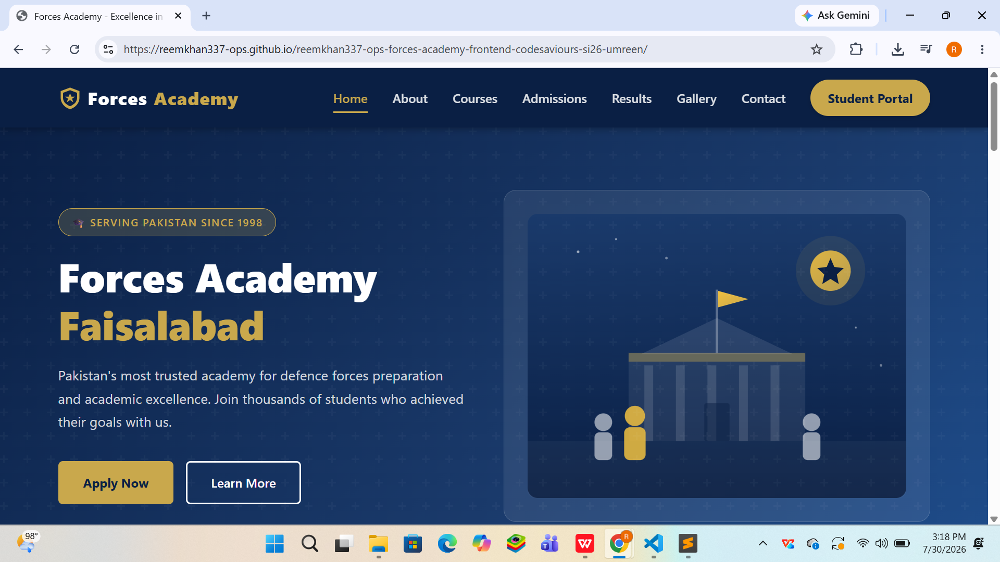
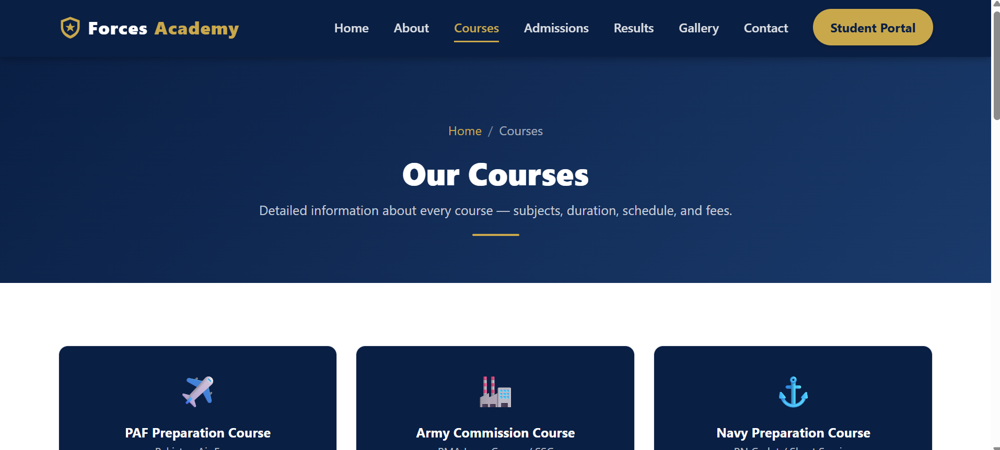
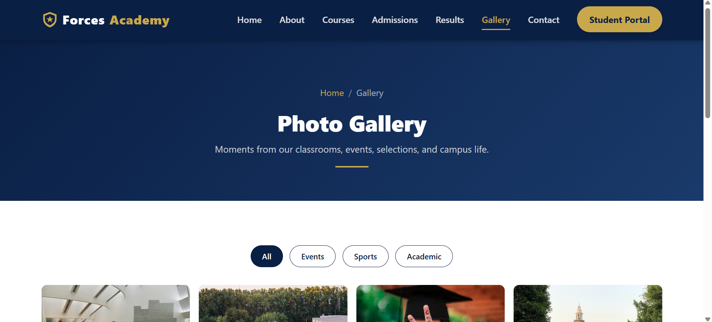
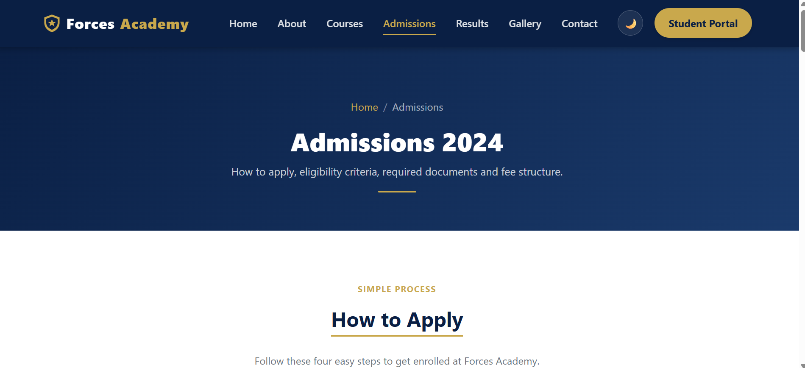

# Forces Academy — Public Website

A 7-page, fully responsive public website for **Forces Academy**, built as part of the
Code Saviours Frontend Track internship (SI-26). Pure frontend project — no backend or
database used.

🔗 **Live Site:** [https://reemkhan337-ops.github.io/reemkhan337-ops-forces-academy-frontend-codesaviours-si26-umreen/](https://reemkhan337-ops.github.io/reemkhan337-ops-forces-academy-frontend-codesaviours-si26-umreen/)

## Screenshot

| Home | Courses | Gallery | Admissions |
|---|---|---|---|
|  |  |  |  |

## Tech Stack

- HTML5
- CSS3 (custom stylesheet, no framework overrides hacked)
- Bootstrap 5.3 (grid system + components)
- Vanilla JavaScript (no frameworks/libraries)

## Pages

| Page | File | Description |
|---|---|---|
| Home | `index.html` | Hero banner, about snippet, courses preview, stats counter, testimonials, CTA |
| About | `about.html` | Academy history/timeline, mission, vision, leadership team |
| Courses | `courses.html` | Course cards — subjects, duration, schedule, fees |
| Admissions | `admissions.html` | How to apply, eligibility table, required documents, fee structure |
| Results | `results.html` | Student results table, filterable by course and year |
| Gallery | `gallery.html` | Filterable photo grid with a custom lightbox popup |
| Contact | `contact.html` | Contact form (frontend validation only), Google Maps embed, address/phone |

## Folder Structure

```
forces-academy/
├── index.html
├── about.html
├── courses.html
├── admissions.html
├── results.html
├── gallery.html
├── contact.html
├── css/
│   └── style.css
├── js/
│   └── main.js
├── images/
│   └── (add real photos here)
└── README.md
```

## Features

- Fully responsive — tested on mobile and desktop breakpoints using Bootstrap's grid
  (`col-`, `col-md-`, `col-lg-`) and the in-browser device toolbar.
- Animated stats counter on the Home page (vanilla JS, `IntersectionObserver`,
  counts up over 2 seconds when scrolled into view).
- Testimonials slider on the Home page (Bootstrap Carousel, autoplay every 4s
  + manual prev/next controls and dot indicators).
- Smooth scroll enabled site-wide (`scroll-behavior: smooth` + JS anchor handling).
- Floating "Back to Top" button on every page — appears after 300px of scroll,
  hides at the top, animated scroll to top on click.
- Gallery filter buttons + custom lightbox popup (no external lightbox library).
- Results table filterable by course and year using `<select>` dropdowns.
- Contact form with simple required-field validation and a success toast
  (frontend only — no data is actually sent anywhere, since there's no backend).
- "Student Portal" button in the navbar links out to the Full Stack LMS.
- Dark mode toggle in the navbar on every page — preference saved in
  `localStorage` and restored on every page load (no flash of light content).
- Subtle page-load animations on the Home page: hero heading fades in,
  stats cards slide up on scroll, course cards appear one by one with a
  staggered delay (`IntersectionObserver` + CSS `@keyframes`).
- Basic on-page SEO: unique `meta description`/`meta keywords` and Open
  Graph tags (`og:title`, `og:description`) on all 7 pages, plus a shared
  SVG favicon (`favicon.svg`, reuses the navy/gold crest logo).

## Cross-Page Consistency Review

- Navbar and footer markup checked identical across all 7 pages (only the
  active nav-link differs per page, as expected).
- All internal links (`index.html`, `about.html`, `courses.html`,
  `admissions.html`, `results.html`, `gallery.html`, `contact.html`) verified
  — no broken links.
- All images load correctly (SVG illustrations + JPG gallery photos, all
  under 320KB, no compression needed).
- Pages tested for responsiveness at 375px (mobile), 768px (tablet), and
  1440px (desktop): **index.html, about.html, courses.html, admissions.html,
  results.html, gallery.html, contact.html** — all 7 pages.

## Dark Mode, Animations & SEO

- Dark mode toggle button added to the navbar on all 7 pages (moon icon in
  light mode, sun icon in dark mode). Toggles a `dark-mode` class on
  `<body>` via `js/main.js`; all dark colors are defined under the
  `body.dark-mode` selector in `css/style.css`. Preference persists across
  pages using `localStorage`.
- CSS `@keyframes` animations added on the Home page: hero heading/badge/text
  fade in on load, stats cards slide up and course cards fade in one-by-one
  (staggered) when scrolled into view, using `IntersectionObserver`.
- SEO basics on all 7 pages: `meta description` (150–160 characters),
  `meta keywords`, `og:title`, `og:description`, and a shared SVG favicon
  (`favicon.svg`). All images already had descriptive `alt` text from
  earlier weeks — re-checked and confirmed.

## Student Portal Link, Admission Enquiry Form, Announcements

- "Student Portal" button in the navbar (all 7 pages) now links to the Full
  Stack partner's live LMS: `https://forces-academy-lms.infinityfree.io/`
  (opens in a new tab).
- Admission Enquiry form on `admissions.html` sends real emails using
  EmailJS (no backend needed) — validates all fields client-side, shows a
  loading state on submit, and a success/error toast.
- "Latest Announcements" section added to `index.html` with 3 sample
  announcement cards (result announcement, admission deadline, event notice).

## Final Polish & Submission Prep

- Full final pass across all 7 pages: every nav link, footer link, the
  Student Portal button, the Admission Enquiry form, and the dark mode
  toggle re-tested and confirmed working.
- Re-checked responsiveness at 375px (mobile), 768px (tablet), and 1440px
  (desktop) one last time on all 7 pages.
- README rewritten to final recruiter-ready form (this file).

## How to Run Locally

No build step needed — just open `index.html` in a browser, or serve the folder with
any static server, e.g.:

```bash
npx serve .
```

## Known Issues / Future Improvements

- The general **Contact** page form (`contact.html`) is frontend-validation
  only and does not send real emails — only the **Admissions** page form
  (`admissions.html`) is wired up to EmailJS.
- Results table data is placeholder/sample data, not pulled from a live
  database.
- Footer social media icons (Facebook, Instagram, YouTube, WhatsApp) are
  placeholders (`href="#"`) — real account links to be added later.
- With more time: connect the Contact form to EmailJS as well, replace
  Gallery/Results placeholder data with real academy data, and add real
  photography in place of the SVG illustrations.

---

**Built by:** Umreen (Frontend) | Code Saviours SI-26 | 2026


